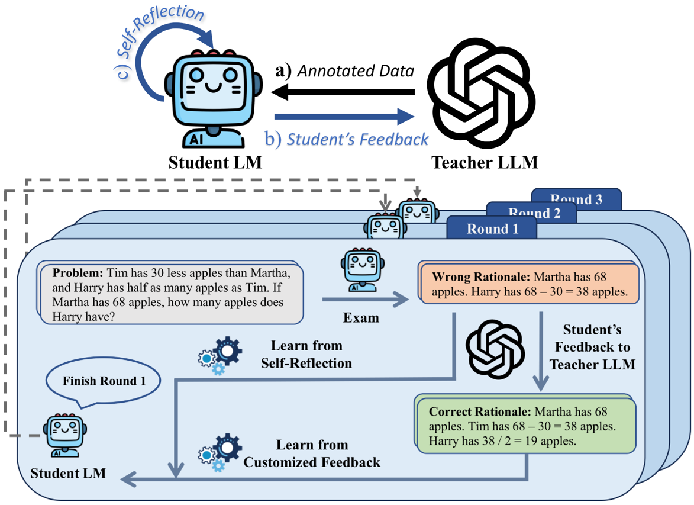

## Democratizing Reasoning Ability

Code for [paper](https://arxiv.org/pdf/2310.13332.pdf) "Democratizing Reasoning Ability: Tailored Learning from Large Language Model" accepted by EMNLP 2023. 



### Requirements

1. python 3.8.16
2. pytorch 1.13.1
3. transformers 4.28.1
4. accelerate 0.18.0
5. datasets 2.10.1
6. deepspeed 0.9.1

### Training

Run the following command to train the student LM GPT-J-6B on the GSM8K dataset for the initial round of learning. We have released the collected rationales in the GitHub release page for research use. If your device supports bf16, please replace ``--fp16`` to ``--bf16`` for a more stable training.

```bash
python run_trainer.py \
    --device "0,1,2,3,4,5,6,7" \
    --task "gsm8k" \
    --load "EleutherAI/gpt-j-6B" \
    --save_best '0' \
    --epoch "10" \
    --teacher_data "localdataset/gsm8k/gsm8k.train.round1.json" \
    --fewshot "yes" \
    --train_bsz "2" \
    --fp16 "yes" \
    --contrastive "yes" \
    --cl_pos_path "localdataset/gsm8k/gsm8k.train.round1.json" \
    --cl_neg_path "localdataset/gsm8k/gsm8k.student.train.round0.neg4.json" \
    --cl_ratio "0.5" \
    --merge_losses "yes" \
    --do_eval "yes" \
    --weight_decay "0.01" \
    --lr "7e-6" \
    --deepspeed "ds_stage3_config.json"
```

### Evaluation

```bash
python infer.py --task gsm8k --test_on test --device $(seq -s , 0 7) --fewshot --rationale --checkpoint checkpoints/student_train/saved_ckpt_path
```

### For the Next Round

Take the "exam" on the train set first to collect the self-made mistakes.

```bash
python infer_student_wrong.py \
    --task gsm8k \
    --rationale --fewshot \
    --batch 4 --test_on train \
    --note "round1" --device $(seq -s , 0 7) \
    --checkpoint checkpoints/student_train/saved_ckpt_path 
```

Use the prompt template mentioned in the paper to collect the teacher's feedback with these mistakes from ChatGPT. Replace the ``--teacher_data, --cl_pos_path, --cl_neg_path`` and update``--checkpoint path_to_ckpt_of_round1`` in the above training command to start the next round of training. Please refer to ``args.py`` for detailed usage.

### Citation

If you find our paper or codes useful, please kindly cite:

```
@inproceedings{wang-etal-2023-democratizing,
    title = "Democratizing Reasoning Ability: Tailored Learning from Large Language Model",
    author = "Wang, Zhaoyang  and
      Huang, Shaohan  and
      Liu, Yuxuan  and
      Wang, Jiahai  and
      Song, Minghui  and
      Zhang, Zihan  and
      Huang, Haizhen  and
      Wei, Furu  and
      Deng, Weiwei  and
      Sun, Feng  and
      Zhang, Qi",
    editor = "Bouamor, Houda  and
      Pino, Juan  and
      Bali, Kalika",
    booktitle = "Proceedings of the 2023 Conference on Empirical Methods in Natural Language Processing",
    month = dec,
    year = "2023",
    address = "Singapore",
    publisher = "Association for Computational Linguistics",
    url = "https://aclanthology.org/2023.emnlp-main.120",
    pages = "1948--1966"
}
```

or

```
@article{wang2023democratizing,
      title={Democratizing Reasoning Ability: Tailored Learning from Large Language Model}, 
      author={Zhaoyang Wang and Shaohan Huang and Yuxuan Liu and Jiahai Wang and Minghui Song and Zihan Zhang and Haizhen Huang and Furu Wei and Weiwei Deng and Feng Sun and Qi Zhang},
      year={2023},
      eprint={2310.13332},
      archivePrefix={arXiv},
      primaryClass={cs.CL}
}
```